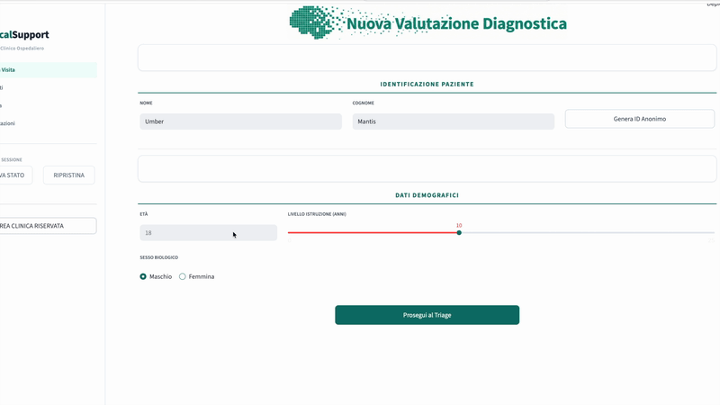
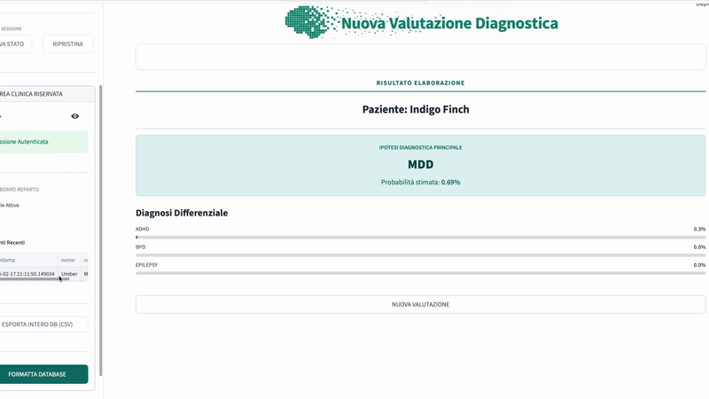

# 🧠 NeuroDiag-AI: Clinical Decision Support System

[](https://streamlit.io)
[](https://python.org)
[](https://sqlite.org)
[](https://scikit-learn.org/)

> [!CAUTION]
> ### ⚠️ IMPORTANT MEDICAL DISCLAIMER
>
> **This software is a simulation developed exclusively for educational, research, and portfolio purposes.**
>
> It is **NOT** a medical device. It does **NOT** provide real clinical diagnoses. It must **NEVER** be used for self-diagnosis or to inform therapeutic decisions.
>
> The diagnostic outputs are probabilistically generated based on synthetic data and machine learning models, and may contain errors or biases. Always consult a qualified healthcare professional for medical advice.

## 🏥 Project Overview

**NeuroDiag-AI** is a proof-of-concept **Clinical Decision Support System (CDSS)** designed to assist in the preliminary stratification of psychiatric and neurological conditions.

Inspired by the "Progressive Triage" architecture (à la MDCalc), the application guides the clinician through a structured data collection flow:

1.  **Identity & Demographics**: Pseudonymized patient entry (Color-Animal protocol).
2.  **Symptom Triage**: "Onion-skin" questionnaire logic that deepens only when necessary.
3.  **Psychometrics**: Integration of standard clinical scales (HAM-D, GAD-7, PANSS, UPDRS, MMSE).
4.  **AI Inference**: A neural network analyzes the holistic patient profile to suggest a probabilistic differential diagnosis.





## ⚡️ Key Features & Usability

This software isn't just a classifier inside a "black box"; it's a **guided clinical workflow** designed to reduce cognitive load and mimic expert reasoning.

### 🧅 1. The "Onion Triage" Architecture

Traditional medical forms are often "Walls of Text" that overwhelm the user. **NeuroDiag-AI** solves this with a **dynamic, multi-layered interview system**:

*   **Step 1 (Macro)**: The system asks broad screening questions (e.g., *"Do you have mood disturbances?"*).
*   **Step 2 (Micro - Conditional Branching)**: **ONLY IF** the answer is positive, a new layer "peels open" to reveal specific inquiries (e.g., *"Do you feel sad in the morning? Have you lost interest in hobbies?"*).

**Why it matters:** This mirrors the **Differential Diagnosis** process of a real physician, filtering out noise and focusing only on relevant clinical signals.

### 🛠️ Core Functionalities

*   **🧠 10k Synthetic Patient Training**: The AI model is trained on a massive dataset of **10,000 statistically generated cases**. These are **GDPR-free by design** but clinically plausible, covering complex spectra like ADHD, Major Depression, Parkinson's, and BPD.
*   **📊 Integrated Psychometric Scales**: Seamless integration of gold-standard calculators (HAM-D, UPDRS, PANSS) with intuitive sliders and score interpretation.
*   **🛡️ Privacy-First EMR**: A built-in **Electronic Medical Record** system powered by a local SQLite database. An **Admin Gate** (password-protected) strictly separates the patient data view from the clinician's dashboard.
*   **📈 Visual Explainability**: Diagnostic outputs are accompanied by **Radar Charts (Spider Plots)**, allowing clinicians to visualize comorbidities and symptom clusters at a glance.
*   **📑 Automated Reporting**: Generates professional **PDF Reports**, ready for printing or attaching to patient files.

### 🎨 Usability & User Experience (UX)

*   **Clean & Responsive**: Built with Streamlit for a modern, distraction-free interface that works on desktops and tablets.
*   **Visual Progress**: A step-by-step progress bar keeps the user oriented within the clinical flow.
*   **Semantic Design**: Uses medical-grade color coding (Teal for input fields, Orange for clinical alerts) to guide attention intuitively.

## 🧬 Synthetic Data Engineering

To ensure **GDPR compliance by design** and zero privacy risks, no real patient data was used in the training of this system.

Instead, a sophisticated **Synthetic Patient Generator** was engineered to create **10,000 unique clinical profiles**.
- **Clinical Plausibility**: Expert-defined rules encode known comorbidities (e.g., Depression + Anxiety, Parkinson's + Depression).
- **Hard Constraints**: Logical locks prevent clinically impossible combinations (e.g., exclusionary criteria for specific differential diagnoses).
- **Statistical Distribution**: Data is generated to reflect realistic prevalence rates while ensuring sufficient minority class representation for model training.

The result is a dataset that mathematically resembles a real hospital population essentially "hallucinated" by clinical logic, allowing for rigorous model training without ethical friction.

## 🤖 Authorship & AI-Assisted Engineering

This project is a transparent demonstration of modern **AI Orchestration**: the ability to bridge deep domain expertise (Clinical Medicine) with software engineering through the use of advanced Large Language Model (LLM) agents.

### 🧠 The Role of the Author: Domain Expert & Architect
The intellectual core of this software—the **"What"** and the **"Why"**—is exclusively human-derived:
*   **Clinical Logic**: The matrix of differential diagnoses, the exclusion criteria, and the risk stratification algorithms.
*   **Synthetic Data Rules**: The statistical rules used to engender 10,000 plausible patient profiles (e.g., comorbidity prevalence, symptom clustering).
*   **UX Architecture**: The "Onion Triage" design pattern was architected specifically to solve the clinical problem of cognitive overload.

### ⚡ The Role of AI: Code Execution & Pair Programming
The LLM agents (Gemini/Antigravity) acted as a high-level **"Pair Programmer"**, handling the **"How"**:
*   **Rapid Implementation**: Translating specific clinical requirements into functional Python/Streamlit code.
*   **Boilerplate & Refactoring**: Managing standard coding patterns, directory structures, and error handling.

### 🚀 Value Proposition: The "Bridge" Competence
**NeuroDiag-AI** showcases a critical new skill set: the ability to orchestrate AI agents to transform **Bio/Medical Domain Knowledge** into a deployed, scalable, and secure software product in a fraction of the traditional development time. This is **Human-in-the-Loop** engineering at its most efficient.


## 🚀 Quickstart & Installation

Follow these steps to set up the project locally on your machine.

### 1. Prerequisites
Ensure you have the following installed:
*   **Python 3.9+**
*   **Git**

### 2. Clone the Repository
Open your terminal and clone the project:

```bash
cd ~/DEV/01_Progetti  # Or your preferred development folder
git clone https://github.com/stefanopisani91/NeuroDiag-AI.git
cd NeuroDiag-AI
```

### 3. Set Up Virtual Environment (Crucial)
It is **highly recommended** to use a virtual environment to manage dependencies and avoid conflicts.

**macOS / Linux:**
```bash
python3 -m venv .venv
source .venv/bin/activate
```

**Windows:**
```bash
python -m venv .venv
.venv\Scripts\activate
```

### 4. Install Dependencies
Install the required packages from `requirements.txt`:

```bash
pip install -r requirements.txt
```

### 5. Run the App
Launch the Streamlit application:

```bash
streamlit run app/app.py
```

The application will automatically open in your default browser at `http://localhost:8501`.

## 👨‍⚕️💻 About the Developer

I bridge the gap between **Clinical Medicine** and **Data Science**.

Combining a strong medical background from my previous studies in Medicine with my current advanced studies in **Biology**, I am transitioning into a career as a **Data Analyst / Bioinformatician**.

This hybrid expertise allows me to:
- **Understand the "Why"**: Deeply comprehend the physiological and pathological meaning behind the data.
- **Build the "How"**: Architect robust code solutions that respect the complexity of biological systems.

---
*Built with ❤️ and ☕ by Stefano Pisani.*
